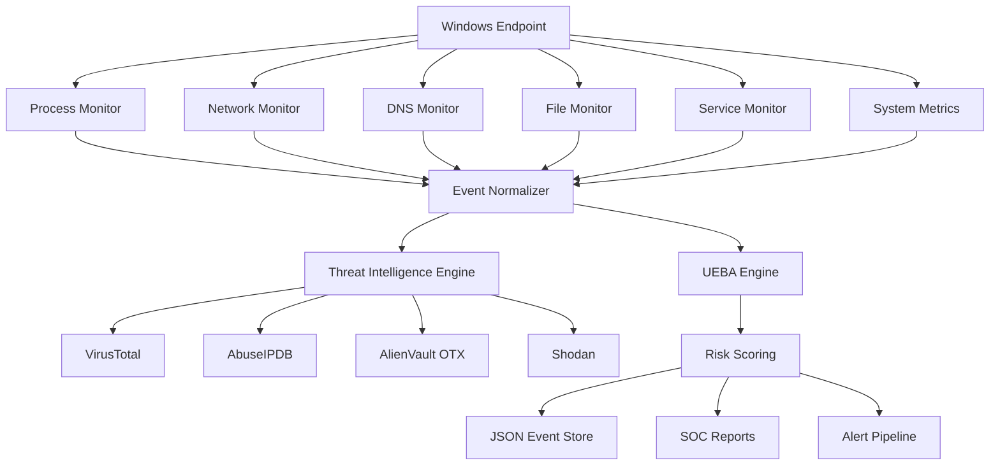
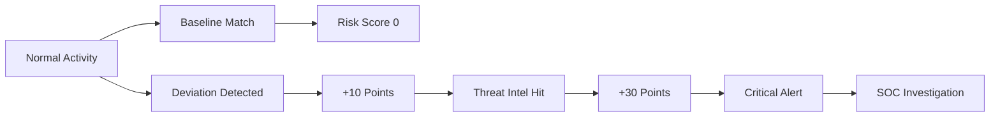
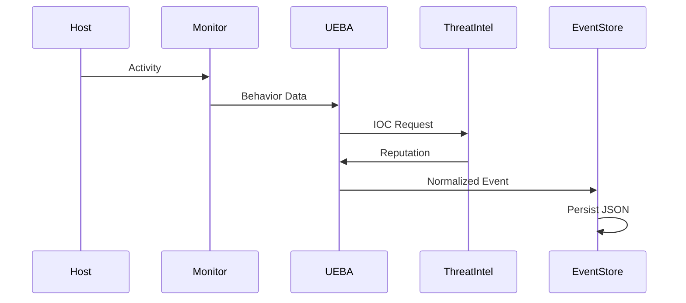

<div align="center">

# 🛡️ Enterprise Security Monitoring & Threat Intelligence Platform


<br>


<br><br>


### 🚀 Production Grade Security Operations Platform

**Monitor. Detect. Investigate. Respond.**

A high-performance security automation ecosystem designed for Security Operations Centers (SOC), Threat Hunters, Blue Teams, Detection Engineers, and Cybersecurity Researchers.

</div>

---

# ⚡ Platform Overview

This platform continuously monitors:

🔹 Windows Host Activity

🔹 Running Processes

🔹 Network Connections

🔹 DNS Activity

🔹 Windows Services

🔹 File Modifications

🔹 User Behavior

🔹 Threat Intelligence Reputation

🔹 Host Risk Scores

🔹 Security Events

All events are normalized into a SIEM-compatible JSON schema and stored for future investigations.

---

# 🎯 Core Capabilities

<table>
<tr>
<td width="50%">

## 🖥️ Endpoint Monitoring

* Process Discovery
* Process Hashing
* Service Monitoring
* CPU Monitoring
* RAM Monitoring
* Disk Monitoring
* User Session Tracking

</td>

<td width="50%">

## 🌐 Network Monitoring

* Active Connections
* DNS Cache Parsing
* Public IP Reputation
* Domain Reputation
* Socket Analysis
* Connection State Tracking

</td>
</tr>

<tr>
<td>

## 📂 File Integrity Monitoring

* Real-Time Watchdog
* File Creation Alerts
* File Modification Alerts
* File Deletion Alerts
* SHA256 Hash Generation

</td>

<td>

## 🧠 UEBA Analytics

* Baseline Learning
* Peer Group Comparison
* Login Pattern Analysis
* Behavioral Deviations
* Dynamic Risk Scoring

</td>
</tr>
</table>

---

# 🏗️ Enterprise Architecture



---

# 🔥 Threat Intelligence Engine

<div align="center">

| Source         | Purpose                       |
| -------------- | ----------------------------- |
| VirusTotal     | IP / Domain / Hash Reputation |
| AbuseIPDB      | Malicious IP Detection        |
| AlienVault OTX | IOC Intelligence              |
| Shodan         | Internet Exposure Analysis    |

</div>

---

# 🧠 UEBA Engine

The User & Entity Behavior Analytics engine continuously builds behavioral baselines.

### Tracked Attributes

```text
Login Hours
Login Days
Known Source IPs
Known Devices
Session Duration
Process Activity
Network Activity
Department Peers
Role-Based Behavior
Risk Escalation History
```

---

# 📈 Risk Score Lifecycle



---

# 📂 Project Structure

```text
SOC/

├── main.py
│
├── config/
│   ├── settings.py
│   └── constants.py
│
├── modules/
│   ├── virustotal/
│   ├── windows/
│   ├── threat_intel/
│   ├── network_monitor/
│   ├── file_monitor/
│   └── ueba/
│
├── utils/
│   ├── logger.py
│   ├── json_manager.py
│   ├── validators.py
│   └── error_handler.py
│
├── data/
│   ├── events/
│   ├── logs/
│   ├── baselines/
│   └── reports/
│
└── docs/
```

---

# ⚙️ Installation

## Clone Repository

```bash
git clone https://github.com/yourusername/security-monitoring-platform.git

cd security-monitoring-platform
```

## Install Dependencies

```bash
pip install -r requirements.txt
```

---

# 🔑 Configuration

Create:

```json
config.json
```

```json
{
  "api_keys": {
    "virustotal": "API_KEY",
    "abuseipdb": "API_KEY",
    "alienvault": "API_KEY",
    "shodan": "API_KEY"
  }
}
```

---

# 🚀 Launch Platform

```bash
python main.py
```

---

# 📄 Standardized Event Format

```json
{
  "event_id": "EVT-UUID",
  "timestamp": "2026-06-06T11:24:15Z",
  "module": "network_connection",
  "severity": "HIGH",
  "event_type": "network_connection",
  "status": "success",
  "data": {}
}
```

---

# 📊 Event Pipeline



---

# 🛡️ Security Features

✅ Thread-Safe Logging

✅ Corrupt JSON Recovery

✅ Automatic Log Rotation

✅ Threat Intelligence Caching

✅ Rate Limit Protection

✅ Modular Plugin Design

✅ SIEM Compatible Events

✅ Behavioral Risk Scoring

✅ Multi-Source Reputation Analysis

✅ Enterprise Scalability

---

# 📊 Technology Stack

<div align="center">

| Layer        | Technologies                       |
| ------------ | ---------------------------------- |
| Language     | Python                             |
| Monitoring   | psutil, watchdog                   |
| Threat Intel | VirusTotal, AbuseIPDB, OTX, Shodan |
| Data Format  | JSON                               |
| Logging      | Rotating File Handlers             |
| Architecture | Modular SOC Framework              |
| Analytics    | UEBA                               |
| Storage      | Local JSON Database                |

</div>

---

# 🎯 Future Roadmap

* [ ] Real-Time Dashboard
* [ ] Elasticsearch Integration
* [ ] Wazuh Integration
* [ ] Sigma Rule Engine
* [ ] MITRE ATT&CK Mapping
* [ ] Machine Learning Detection Models
* [ ] Grafana Visualization
* [ ] Kafka Event Streaming
* [ ] Docker Deployment
* [ ] Kubernetes Support

---

# 🌟 Why This Project?

This platform demonstrates expertise in:

* Detection Engineering
* Threat Intelligence
* Security Automation
* SOC Operations
* UEBA Analytics
* Python Development
* Windows Monitoring
* Incident Detection
* Security Architecture

making it an excellent enterprise-grade cybersecurity portfolio project.

---

<div align="center">

### ⭐ Star the Repository

### 🛡️ Secure Everything

### 🚀 Automate Detection


</div>
