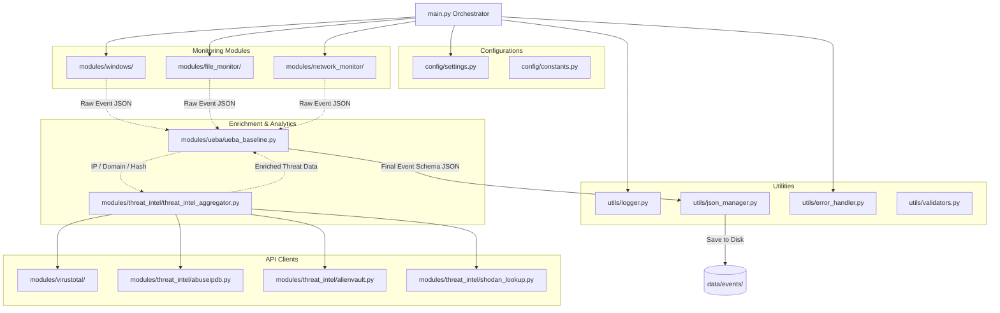

# Enterprise Security Monitoring - Code Architecture Diagram

Below is the structured layout and communication architecture of the platform.

---

## 1. Directory Structure

```text
c:\Users\jasht\OneDrive\Desktop\SOC/
│
├── main.py                          # Controller & Scheduler
│
├── requirements.txt                 # Dependencies list
│
├── config/
│   ├── settings.py                  # Environment & settings loader
│   └── constants.py                 # Severity, intervals & constants
│
├── utils/
│   ├── logger.py                    # Thread-safe rotating logger
│   ├── json_manager.py              # Locking, writing, rotating JSON
│   ├── timestamp.py                 # UTC timestamp builder
│   ├── validators.py                # Regex-based IP, domain, hash check
│   └── error_handler.py             # Centralized exception logging & retries
│
├── modules/
│   ├── virustotal/
│   │   ├── virustotal.py            # High-level Virustotal API orchestrator
│   │   ├── check_ip.py              # VT IP lookup
│   │   ├── check_domain.py          # VT Domain lookup
│   │   ├── check_file.py            # VT File Upload/check
│   │   └── check_hash.py            # VT Hash check
│   │
│   ├── windows/
│   │   ├── system_usage.py          # Disk, CPU, Memory, IO
│   │   ├── process_monitor.py       # Active PIDs and parent PIDs (WMI + psutil)
│   │   ├── network_connections.py   # Active TCP/UDP endpoints
│   │   └── services.py              # SCM service states
│   │
│   ├── threat_intel/
│   │   ├── threat_intel_aggregator.py # Aggregates threat reports & handles caching
│   │   ├── abuseipdb.py             # AbuseIPDB API
│   │   ├── alienvault.py            # AlienVault OTX API
│   │   └── shodan_lookup.py         # Shodan API & InternetDB
│   │
│   ├── file_monitor/
│   │   ├── file_events.py           # Watchdog directories observer
│   │   ├── file_hashing.py          # MD5/SHA-256 chunk-based hasher
│   │   └── integrity_monitor.py     # Check hashes against static baseline
│   │
│   ├── network_monitor/
│   │   ├── dns_monitor.py           # DNS Cache query monitor
│   │   ├── ip_monitor.py            # Active IP address monitoring
│   │   └── connection_monitor.py    # Matches sockets with process info
│   │
│   └── ueba/
│       └── ueba_baseline.py         # UEBA behavior baselines & anomaly flags
│
└── data/
    ├── events/                      # Stored event JSON outputs
    ├── logs/                        # System log files
    ├── baselines/                   # Behavioral profiles & file baselines
    └── reports/                     # End-of-day/hourly HTML or JSON summaries
```

---

## 2. Interaction Diagram


