# Enterprise Security Monitoring - Detailed System Design

This document details the architecture, schemas, and event lifecycle that govern the platform.

---

## 1. System Architecture & Component Relationships

```mermaid
graph TD
    Main[main.py Orchestrator] --> Config[config/settings.py]
    Main --> Utils[utils/logger.py, json_manager.py, error_handler.py]
    
    %% Windows Modules
    Main --> WinMon[modules/windows/]
    WinMon --> Usage[system_usage.py]
    WinMon --> Process[process_monitor.py]
    WinMon --> NetConn[network_connections.py]
    WinMon --> Services[services.py]
    
    %% File & Network Modules
    Main --> FileMon[modules/file_monitor/]
    FileMon --> FileEvents[file_events.py]
    FileMon --> Integrity[integrity_monitor.py]
    
    Main --> NetMon[modules/network_monitor/]
    NetMon --> DNSMon[dns_monitor.py]
    NetMon --> ConnMon[connection_monitor.py]

    %% Threat Intel
    Main --> IntelAgg[modules/threat_intel/threat_intel_aggregator.py]
    IntelAgg --> VT[virustotal/virustotal.py]
    IntelAgg --> Abuse[abuseipdb.py]
    IntelAgg --> OTX[alienvault.py]
    IntelAgg --> Shodan[shodan_lookup.py]
    
    %% UEBA Engine
    Main --> UEBA[modules/ueba/ueba_baseline.py]
    
    %% Storage
    Utils --> Storage[(data/ storage)]
```



---

## 2. Event & Data Flow

1. **Trigger / Timer Fires:** A background monitor (e.g., file observer or thread-scheduled process monitor) notices a change or completes an interval check.
2. **Raw Collection:** The module collects the native data (e.g., processes running, active connections, files modified).
3. **Normalization:** The raw data is passed through `validators.py` and converted to the standard JSON event wrapper.
4. **Enrichment (Asynchronous threat lookup):** If the event involves an external IP, domain, or file hash, it is queued for Threat Intelligence enrichment. The `threat_intel_aggregator` checks its local cache first, queries API endpoints if needed, and appends threat data.
5. **UEBA Evaluation:** Events are analyzed by the UEBA baseline engine. If session behavior deviates or a risk score threshold is exceeded, a `ueba_anomaly` event is created.
6. **Logging and Persistence:** The `json_manager` writes the finalized JSON event to the `data/events/` directory, while `logger.py` records operational details in `data/logs/`.

---

## 3. JSON Schemas

### A. Standard Event Schema
Every event generated by any module in the system must strictly conform to this schema:

```json
{
  "event_id": "EVT-8f9d0c24-b52e-4b2f-870a-7e3e9d8b74c0",
  "timestamp": "2026-06-06T10:30:00.000Z",
  "module": "windows_process",
  "event_type": "process_created",
  "severity": "INFO",
  "status": "success",
  "data": {
    "pid": 4532,
    "name": "notepad.exe",
    "ppid": 1284,
    "exe": "C:\\Windows\\System32\\notepad.exe",
    "command_line": "notepad.exe C:\\temp\\notes.txt",
    "username": "WORKGROUP\\jash"
  }
}
```

### B. Normalized Threat Intelligence Schema
When lookups are completed across different APIs, they are normalized into this common schema:

```json
{
  "indicator": "8.8.8.8",
  "type": "ip",
  "is_malicious": false,
  "reputation_score": 0,
  "positives": 0,
  "total_scans": 90,
  "cached_at": "2026-06-06T10:30:00.000Z",
  "sources": {
    "virustotal": {
      "status": "success",
      "positives": 0,
      "total": 92,
      "malicious_votes": 0,
      "harmless_votes": 88
    },
    "abuseipdb": {
      "status": "success",
      "abuse_score": 0,
      "total_reports": 0,
      "country_code": "US"
    },
    "alienvault": {
      "status": "success",
      "pulse_count": 0,
      "malware_count": 0
    },
    "shodan": {
      "status": "success",
      "ports": [53, 443],
      "vulns": []
    }
  }
}
```

### C. UEBA Baseline Expansion Schema
Incorporates User and Entity Behavior Analytics for profiles, session behaviors, and risk scoring.

```json
{
  "user_id": "jash",
  "department": "Engineering",
  "peer_group": "Developers",
  "baseline_established_at": "2026-06-06T10:00:00.000Z",
  "behavioral_baselines": {
    "usual_working_hours": {
      "start": "09:00",
      "end": "18:00"
    },
    "common_ips": ["192.168.1.50"],
    "common_processes": ["chrome.exe", "vscode.exe", "git.exe"],
    "daily_avg_file_writes": 120,
    "daily_avg_network_mb": 450.0
  },
  "session_behavior_metrics": {
    "login_time": "2026-06-06T10:57:00.000Z",
    "source_ip": "192.168.1.50",
    "session_duration_sec": 3600,
    "active_processes_count": 14,
    "network_volume_transferred_mb": 12.4
  },
  "peer_group_deviation": {
    "is_unusual_time": false,
    "is_unusual_process": false,
    "is_unusual_network_volume": false,
    "deviation_percentage": 0.0
  },
  "anomaly_flags": [
    {
      "flag_id": "ANM-001",
      "type": "unusual_process",
      "timestamp": "2026-06-06T10:58:00.000Z",
      "severity": "WARNING",
      "score_weight": 15.0,
      "description": "Executed process outside of common list: powershell.exe"
    }
  ],
  "risk_score": 15.0
}
```
